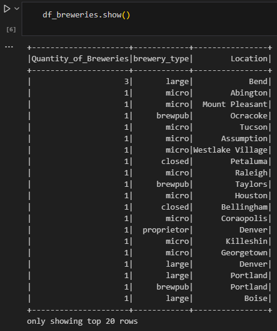

# BEES Data Engineering - Breweries Case

## Objective
The goal of this project is to consume data from the Open Brewery DB API, transform and persist it into a data lake following the **Medallion Architecture** with three layers:
- **Bronze Layer:** Raw data ingestion
- **Silver Layer:** Data transformation and partitioning
- **Gold Layer:** Aggregated analytical layer

## Architecture
This solution is orchestrated using **Apache Airflow** and containerized using **Docker** via **ASTRO CLI**. The pipeline consists of three Jupyter notebooks executed as Airflow DAGs.

### **Pipeline Stages:**
1. **Bronze Layer:**
   - Fetches data from the Open Brewery DB API (`https://api.openbrewerydb.org/breweries`)
   - Saves raw JSON files to `include/data/bronze/breweries/YYYYMMdd/YYYYMMddThhmmss.json`
   - **File Structure Example:**
     

2. **Silver Layer:**
   - Reads JSON files from the Bronze Layer
   - Converts them to **Parquet format**, partitioning by `city`
   - Saves transformed files to `include/data/silver/breweries/YYYYMMdd/YYYYMMddThhmmss.parquet`
   - **File Structure Example:**
     

3. **Gold Layer:**
   - Reads the partitioned Parquet files
   - Aggregates the number of breweries by `city` and `brewery_type` using **SQL queries**
   - Saves the aggregated data in the Gold Layer
   - **File Structure Example:**
     

### **Storage Considerations**
- In a real-world scenario, the data would be stored in a **cloud-based data lake** such as AWS S3, Google Cloud Storage, or Azure Data Lake.
- This project uses **parameterized directory structures** to ensure files are saved in an organized and scalable way.

### **Monitoring & Logging**
- Each run of the notebooks is stored in `include/notebooks/runs` for traceability.
- Airflow's web server provides pipeline monitoring.
- Future improvements can integrate **Datadog** for logging and **email alerts** for failures.

- **Notebook Runs Folder Example:**
  

## **Installation & Setup**

### **Prerequisites**
- Install **ASTRO CLI** ([Installation Guide](https://docs.astronomer.io/astro/install-cli))
- Install **Docker** ([Download](https://www.docker.com/get-started/))

### **Running the Project**
1. Clone the repository:
   ```sh
   git clone https://github.com/MarcoAurelioHFortes/Breweries.git
   cd Breweries
   ```
2. Start the project using Astro CLI:
   ```sh
   astro dev start
   ```
3. Wait for the containers to initialize (check in Docker Desktop if needed).
   
4. Once the `webserver` container is running, access the Airflow UI:
   - Open Docker Desktop and click on the **webserver** port.
   - Or manually go to: `http://localhost:8080`
   - Login with credentials:
     - **Username:** `admin`
     - **Password:** `admin`

### **Triggering & Monitoring DAGs**
- The **main DAG** (`brewery_dag`) is scheduled to run **daily at midnight (00:00)`.
- It **retries up to 4 times** in case of failure.
- You can manually trigger the DAG from the Airflow UI.
- To check the **Gold Layer**, manually trigger `read_breweries_dag`, then navigate to `/include/notebooks/runs` and look for the latest **read notebook** to inspect the DataFrame.

- **Example Read Notebook Output:**
  

## **Future Improvements**
- Implement real-time alerting with **Datadog**.
- Store metadata in a centralized logging system.
- Deploy on **Kubernetes** for better scalability.

---
**Author:** Marco Aurélio Hernandes Fortes  
**Repository:** [GitHub](https://github.com/MarcoAurelioHFortes/Breweries.git)
